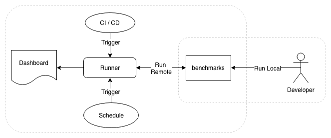

# IPFS Benchmarks

This is a set of benchmarks tests to track IPFS performance.

## Purpose
The IPFS team needs a historical view of various performance metrics around `js-ipfs`
and how it compares to the reference implementation written in `go`. This project
implements benchmark tests for `js-ipfs` and publishes the results in a dashboard.
The artifacts are also made available on the IPFS network. Over time the historical
view will expose how `js-ipfs` is hopefully approaching the `go` implementation
and which areas need improvement.



The goal is to provide immediate feedback and long-term tracking around performance
to developers and the community with an extremely low barrier.
The CI system integrating code changes will trigger benchmark runs as well a scheduled
run every night. Each run will provide a URL where the results will be visible.

This project also provides a possibility to run tests locally on a development
version of `js-ipfs`. Developers can then examine individual output files before
submitting code to the community.

## Documentation Index
* [Architecture](infrastructure/README.md) of the `js-ipfs` benchmark system
* Reference on how this [Repository](REPOSITORY.md) is organized
* Using the [Runner](runner/README.md) to manage benchmark runs remotely
* Description of [tests](tests/README.md)
* Convenience [scripts](scripts/README.md) for the docker-compose [deployment](infrastructure/deploy/README.md)

## Quickstart

Clone Benchmark tests and install:

```bash
>  git clone https://github.com/ipfs/benchmarks.git
>  cd benchmarks/tests
>  npm install
>  cd ../benchmarks/runner
>  npm install
```

### Run tests locally

From the benchmark/tests directory:
```bash
> node local-add
> node loca-extract
> node local-transfer
```

Run all benchmarks:
```bash
> npm run benchmark
```

### Run sub tests
TODO:

###  Results

Results will be written to out directory under /tests
