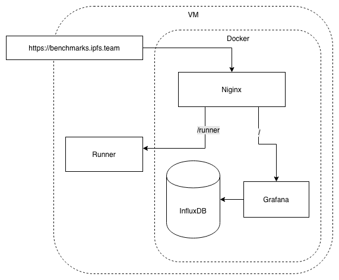

## Deploying the Controller IPFS benchmarks

The runner and it's supporting applications are deployed using [docker-compose](https://docs.docker.com/compose/reference/overview/#command-options-overview-and-help). To run a minimal local development setup you need the following  parts:
1. Nginx
2. InfluxDB
3. Grafana

To run the stack locally all you need is [docker-compose.yaml](docker-compose.yaml) file. The runner runs on the host, listening on port 9000, outside of Docker. The [Ansible](/infrastructure/playbooks/README.md) playbook takes care of creating a Docker network that is allowed to access port 9000 on the host.
For production, there is an nginx reverse proxy to route traffic to `Grafana` on `/` and expose the runner's endpoint on `/runner`.
In production we add the [docker-compose.prod.yaml](docker-compose.prod.yaml) to configure and run the production setup. Also SSL certificate provisioning is handled for production with [certbot](https://github.com/certbot/certbot)

4. nginx
5. certbot

Convenience scripts to run the different docker-compose setups are located under [/scripts](/scripts/README.md)

### Certbot initialization
Nginx is configured to use certificates and will fail if the certificate files are not present. On a new deployment, no certificates will be available so before the first run a dummy certificate should be installed with [sudo ./init_letsencrypt.sh](./init_letsencrypt.sh). This installs a self signed cert starts nginx and certbot will initiate a handshake with let's encrypt to retrieve the real certificate and replace the self signed cert with the real one.

Let's encrypt only works with publicly resolvable domains.

## Continuous Integration and Deployment
This project is being watched by CircleCi. At the end of each successful integration run the runner and test code are redeployed to the controller VM.
The definition of the tests and deployment is contained in the [CircleCi](/.circleci/config.yml) configuration file.